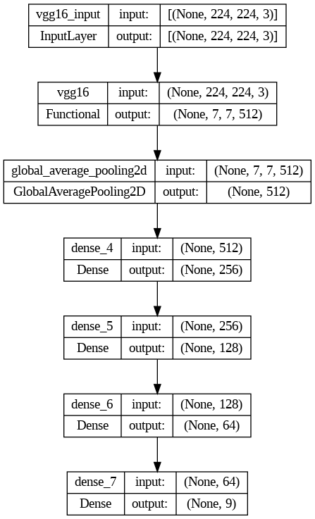
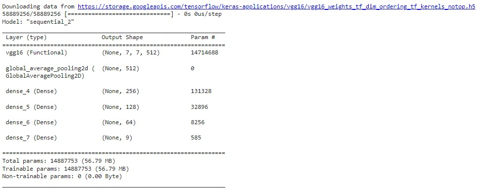
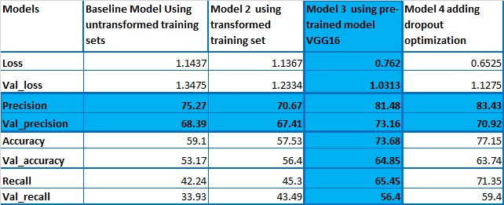

# Multiclass Skin Disease Classification using CNN

Skin diseases come in various forms and can significantly impact an individual's overall health and well-being. Accurate diagnosis is crucial, as some skin disorders, such as various types of skin cancer, can be life-threatening. Dermatologists often face challenges in categorizing and diagnosing skin conditions accurately, which is why cutting-edge technologies like deep learning algorithms are being explored to enhance dermatological diagnostics. This project aims to build a Convolutional Neural Network (CNN) model that can classify nine different types of skin diseases with over 70% precision.
We applied data augmentation to alleviate the overfitting and class-imbalance problems. The classifier has been built with transfer learning technique using a pretrained VGG16 model. The final classifer achieved a precision of 73.2% on validation data. You can check out the notebook that goes along to follow all the steps which have been taken to build the model.

## Data
The classifier has been trained using International Skin Imaging Collaboration (ISIC) Skin Cancer dataset: [data](data_cnn) which contains 2357 images of malignant and benign oncological diseases with nine categories of pigmented skin lesions/skin diseases.

## Model Architecture

The CNN model architecture above is designed to handle the multiclass classification of the 9 skin diseases in our data. It incorporates convolutional layers for feature extraction and dense layers for classification. The model's performance metrics and validation results are discussed in the "Results" section.

## How to Run the App
### Method 1
•Run the [script](CNN.py) file

•Go to [app URL]() on your browser

•Use the Choose button to browse and upload the image you want

•Hit Predict to get the results.

### Method 2
•Deploy it to Azure Webapp or Heroku App through github repository

•Go to url generated after deployment on your browser

•Use the Choose button to browse and upload the image you want

•Hit Predict to get the results.

## Libraries used
• numpy

• keras

• tensorflow-cpu==2.5.0

• pandas

• matplotlib

• pillow

• streamlit

• seaborn

##  Multi_Class_Image_Classification_Project_Final.ipynb
This is the Notebook used to define and train the model: [Final Notebook](Multi_Class_Image_Classification_Project_Final_(1).ipynb)

## Application
This is the streamlit app that needs to run in order to use the webapp: [App](CNN.py)

## FInal saved model name
Contains the weights of the best model: [Best model]()

## CNN Model Summary

  
## Results

## Conclusion
A validation precision of 73%  implies that our model is able to predict correct classes of the nine classes with a 73% probability of success. There is a 27% chance of our model classifying an image into a wrong class.

  
## Recommendations
To build upon our success and advance the model, we recommend the following:
* The model can be used to predict Basal cell carcinoma and Nevus because it shows good predictions
* Obtain a larger image data for training the model.
* Seek data from multiple sources and geographical regions
* Collect data that spans different time periods and age groups.
  
